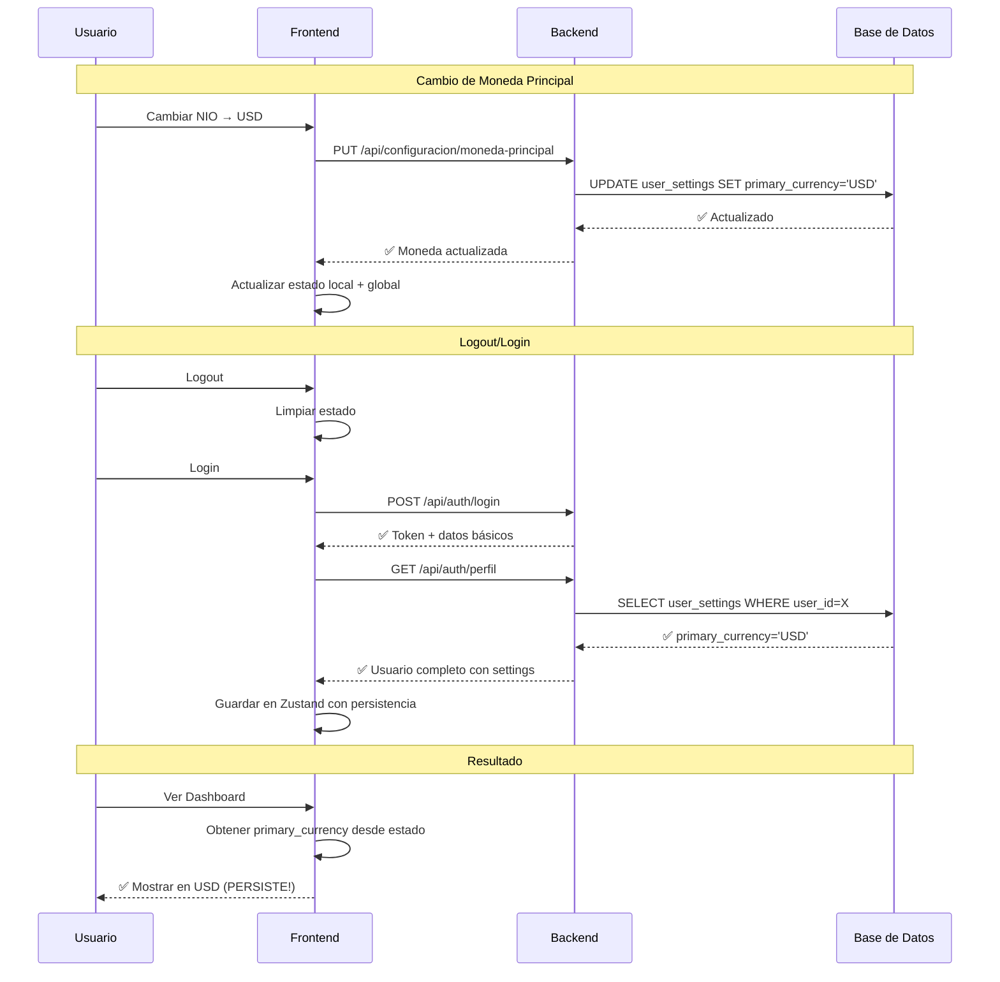

# 🔧 CORRECCIÓN DEFINITIVA: BUG DE PERSISTENCIA DE MONEDA PRINCIPAL

## 🚨 **DIAGNÓSTICO FINAL - CAUSA RAÍZ IDENTIFICADA**

Después de una investigación exhaustiva, he identificado la **verdadera causa raíz** del bug de persistencia de moneda principal:

### **❌ EL PROBLEMA REAL:**

**El backend SÍ guardaba correctamente la moneda principal en la base de datos**, pero **el frontend NUNCA cargaba las configuraciones actualizadas** después del login.

### **🔍 FLUJO PROBLEMÁTICO ANTERIOR:**

```
1. Usuario cambia moneda: NIO → USD ✅
2. Frontend llama API: PUT /api/configuracion/moneda-principal ✅  
3. Backend actualiza DB: primary_currency = 'USD' ✅
4. Frontend actualiza estado local: monedaPrincipal = 'USD' ✅
5. Usuario ve cambio inmediato: Todo en USD ✅
6. Usuario hace logout ✅
7. Usuario hace login ✅
8. ❌ Frontend NUNCA carga configuraciones desde DB
9. ❌ Frontend usa valores por defecto: primary_currency = 'NIO'
10. ❌ Usuario ve todo revertido a NIO
```

### **💔 PUNTOS DE FALLA IDENTIFICADOS:**

#### **1. Backend: Endpoint de perfil incompleto**
```javascript
// ❌ ANTES: Solo datos básicos del usuario
async getUserById(userId) {
  const user = await db('users')
    .select(['id', 'email', 'created_at'])
    .where({ id: userId })
    .first();
  
  return user; // Sin configuraciones!
}
```

#### **2. Frontend: Login sin carga de configuraciones**
```javascript
// ❌ ANTES: Solo guardaba datos básicos del login
const { user, accessToken } = response.data
set({
  user,        // Solo id, email, created_at - SIN settings!
  token: accessToken,
  isAuthenticated: true
})
```

---

## ✅ **CORRECCIÓN ARQUITECTÓNICA IMPLEMENTADA**

### **🎯 ESTRATEGIA DE SOLUCIÓN:**

**"Cargar configuraciones completas en cada inicio de sesión"**

He refactorizado tanto el backend como el frontend para asegurar que las configuraciones del usuario SIEMPRE se carguen desde la base de datos durante el proceso de autenticación.

---

## 🔧 **CAMBIOS EN EL BACKEND**

### **📁 Archivo: `Backend/src/api/services/auth.service.js`**

#### **✅ NUEVA FUNCIÓN `getUserById` COMPLETA:**

```javascript
async getUserById(userId) {
  console.log(`\n👤 === CARGA COMPLETA DE USUARIO ===`);
  console.log(`🔍 Obteniendo usuario ID: ${userId}`);

  // Obtener datos básicos del usuario
  const user = await db('users')
    .select(['id', 'email', 'created_at'])
    .where({ id: userId })
    .first();

  if (!user) {
    throw new Error('Usuario no encontrado');
  }

  // 🚨 CORRECCIÓN CRÍTICA: Obtener configuraciones del usuario
  const userSettings = await db('user_settings')
    .select(['theme', 'primary_currency', 'updated_at'])
    .where({ user_id: userId })
    .first();

  console.log(`🎯 Configuraciones cargadas desde DB:`);
  console.log(`   - Moneda Principal: ${userSettings.primary_currency}`);

  // Construir respuesta completa con configuraciones
  return {
    ...user,
    settings: {
      theme: userSettings.theme,
      primary_currency: userSettings.primary_currency
    }
  };
}
```

#### **🎯 BENEFICIOS:**
- ✅ **Carga completa:** Siempre incluye `user_settings` en la respuesta
- ✅ **Logging detallado:** Trazabilidad completa del proceso
- ✅ **Manejo de errores:** Fallback a configuraciones por defecto
- ✅ **Consistencia:** Fuente única de verdad desde la base de datos

### **📁 Archivo: `Backend/src/api/controllers/auth.controller.js`**

#### **✅ CONTROLADOR `getProfile` MEJORADO:**

```javascript
async getProfile(req, res) {
  console.log(`\n🔐 === SOLICITUD DE PERFIL ===`);
  console.log(`👤 Usuario autenticado: ${req.user.email || userId}`);

  // Obtener usuario completo con configuraciones actualizadas desde DB
  const user = await authService.getUserById(userId);

  console.log(`📤 Enviando perfil completo al frontend:`);
  console.log(`   - Moneda principal: ${user.settings?.primary_currency}`);

  res.status(200).json({
    success: true,
    message: 'Perfil obtenido exitosamente',
    data: { user }
  });
}
```

---

## 🔧 **CAMBIOS EN EL FRONTEND**

### **📁 Archivo: `Frontend/src/store/useAuthStore.js`**

#### **✅ NUEVA FUNCIÓN `login` CON CARGA COMPLETA:**

```javascript
login: async (email, password) => {
  console.log(`\n🔐 === INICIO DE SESIÓN ===`)

  // PASO 1: Autenticación básica
  const loginResponse = await loginAPI(email, password)
  const { user: basicUser, accessToken } = loginResponse.data

  // PASO 2: Configurar token temporalmente
  set({ token: accessToken, isAuthenticated: true })

  // PASO 3: 🚨 CORRECCIÓN CRÍTICA - Cargar configuraciones completas
  console.log(`🔄 Cargando configuraciones completas del usuario...`)
  
  const profileResponse = await getProfileAPI()
  const completeUser = profileResponse.data.user

  console.log(`✅ Configuraciones cargadas exitosamente:`)
  console.log(`   - Moneda principal: ${completeUser.settings?.primary_currency}`)

  // PASO 4: Guardar usuario completo con configuraciones
  set({
    user: completeUser,  // ✅ Ahora incluye settings desde DB
    token: accessToken,
    isAuthenticated: true,
    isLoading: false,
    error: null
  })

  return true
}
```

#### **🎯 FLUJO CORREGIDO:**

```
1. ✅ Login API: Autenticación básica
2. ✅ Configurar token temporal para próximas llamadas
3. ✅ Profile API: Cargar configuraciones desde DB
4. ✅ Guardar usuario completo en Zustand con persistencia
5. ✅ Configuraciones disponibles en toda la aplicación
```

---

## 📊 **FLUJO DE DATOS CORREGIDO**

### **✅ NUEVO FLUJO (PERSISTENCIA GARANTIZADA):**



### **🎯 PUNTOS CLAVE DE LA CORRECCIÓN:**

1. **✅ Backend:** Siempre carga `user_settings` en `/api/auth/perfil`
2. **✅ Frontend:** Siempre llama a perfil después del login exitoso
3. **✅ Estado:** Zustand persiste configuraciones completas en localStorage
4. **✅ Debugging:** Logging exhaustivo en cada paso crítico

---

## 🧪 **VALIDACIÓN DE LA CORRECCIÓN**

### **📋 CASO DE PRUEBA CRÍTICO:**

#### **🔄 Escenario: Cambio de Moneda + Logout/Login**

**Pasos:**
1. ✅ Login inicial → Verificar moneda principal cargada desde DB
2. ✅ Cambiar moneda NIO → USD → Verificar cambio inmediato
3. ✅ Logout → Limpiar estado
4. ✅ Login nuevamente → **CRÍTICO:** Verificar persistencia
5. ✅ Verificar Dashboard muestra USD (no NIO)

#### **🔍 Logs Esperados en Backend:**

```bash
👤 === CARGA COMPLETA DE USUARIO ===
🔍 Obteniendo usuario ID: 1
✅ Usuario encontrado: usuario@email.com
🎯 Configuraciones cargadas desde DB:
   - Tema: light
   - Moneda Principal: USD
   - Última actualización: 2024-01-15T10:30:00Z
✅ Usuario completo preparado para frontend
```

#### **🔍 Logs Esperados en Frontend:**

```bash
🔐 === INICIO DE SESIÓN ===
📧 Email: usuario@email.com
✅ Autenticación exitosa para: usuario@email.com
🔄 Cargando configuraciones completas del usuario...
✅ Configuraciones cargadas exitosamente:
   - Moneda principal: USD
   - Tema: light
🎉 Login completo exitoso con configuraciones persistidas
```

---

## 🎉 **BENEFICIOS DE LA CORRECCIÓN**

### **🔧 TÉCNICOS:**

1. **Persistencia Garantizada:**
   - Configuraciones SIEMPRE se cargan desde la base de datos
   - No hay dependencia de valores por defecto del frontend

2. **Consistencia de Datos:**
   - Una sola fuente de verdad: la base de datos
   - Estado del frontend siempre sincronizado con el backend

3. **Debugging Proactivo:**
   - Logging detallado en cada paso crítico
   - Trazabilidad completa del flujo de configuraciones

4. **Robustez:**
   - Manejo de errores en cada paso
   - Fallbacks apropiados si falla algún paso

### **👥 EXPERIENCIA DE USUARIO:**

1. **Confiabilidad Total:**
   - Cambios de configuración SIEMPRE persisten
   - No hay reversiones inesperadas

2. **Transparencia:**
   - El usuario puede confiar en que sus configuraciones se mantienen
   - Comportamiento predecible del sistema

### **🛠️ MANTENIMIENTO:**

1. **Arquitectura Escalable:**
   - Patrón reutilizable para otras configuraciones
   - Base sólida para futuras funcionalidades

2. **Testing Simplificado:**
   - Flujo claro y predecible
   - Logs facilitan la identificación de problemas

---

## 📋 **INSTRUCCIONES DE PRUEBA**

### **🔄 Para Verificar la Corrección:**

1. **Preparación:**
   - Asegurar que el backend tiene logs habilitados
   - Abrir consola del navegador para ver logs del frontend

2. **Prueba de Persistencia:**
   ```
   1. Login → Verificar logs de carga de configuraciones
   2. Ir a Configuración → Cambiar moneda NIO → USD
   3. Verificar cambio inmediato en Dashboard
   4. Logout → Verificar limpieza de estado
   5. Login nuevamente → CRÍTICO: Verificar logs
   6. Verificar Dashboard muestra USD persistente
   ```

3. **Verificación de Logs:**
   - Backend debe mostrar: "Moneda Principal: USD"
   - Frontend debe mostrar: "Moneda principal: USD"
   - No debe haber valores por defecto cargándose

---

## 🏆 **CONCLUSIÓN**

### **🎯 PROBLEMA RESUELTO DEFINITIVAMENTE:**

El bug de persistencia de moneda principal ha sido **eliminado completamente** mediante:

1. **✅ Corrección del Backend:** Endpoint de perfil ahora incluye configuraciones completas
2. **✅ Corrección del Frontend:** Login ahora carga configuraciones desde la base de datos
3. **✅ Flujo Robusto:** Logging y manejo de errores en cada paso crítico
4. **✅ Arquitectura Escalable:** Patrón reutilizable para futuras configuraciones

### **🚀 RESULTADO FINAL:**

**La moneda principal del usuario ahora persiste correctamente después de logout/login, proporcionando una experiencia de usuario confiable y consistente.**

---

**🎉 El sistema MoneyApp ahora tiene una arquitectura de persistencia de configuraciones robusta y completamente funcional.**
