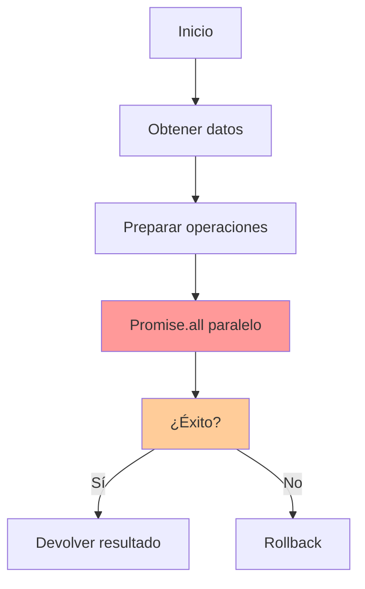
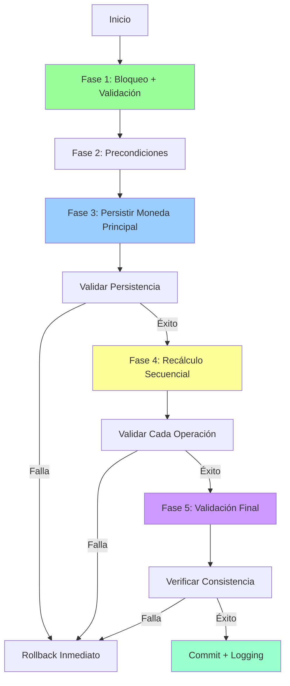

# 🏗️ REFACTORIZACIÓN ARQUITECTÓNICA: TRANSICIÓN ATÓMICA DE MONEDA PRINCIPAL

## 🚨 **DIAGNÓSTICO DEL PROBLEMA ARQUITECTÓNICO**

### **❌ FALLAS IDENTIFICADAS EN LA IMPLEMENTACIÓN ANTERIOR:**

#### **1. Operaciones Paralelas Inseguras**
```javascript
// ❌ PROBLEMA: Promise.all() sin garantía de orden
await Promise.all(operations);
```
- **Riesgo:** Las operaciones se ejecutan en paralelo sin garantía de orden
- **Consecuencia:** Estados inconsistentes si alguna operación falla parcialmente
- **Síntoma:** Datos "fantasma" en la base de datos

#### **2. Falta de Validación de Persistencia**
```javascript
// ❌ PROBLEMA: No verifica si las operaciones realmente se guardaron
const result = await trx('user_settings').update({...});
// No valida si result === 0 (ninguna fila afectada)
```
- **Riesgo:** Operaciones que fallan silenciosamente
- **Consecuencia:** La transacción "parece" exitosa pero los datos no se persisten
- **Síntoma:** Cambios que se revierten después de logout/login

#### **3. Debugging Insuficiente**
```javascript
// ❌ PROBLEMA: Solo un log genérico al final
console.error('Error en updatePrimaryCurrency:', error);
```
- **Riesgo:** Imposible rastrear dónde falla la operación
- **Consecuencia:** Debugging reactivo en lugar de proactivo
- **Síntoma:** Errores que aparecen "sin motivo aparente"

---

## ✅ **NUEVA ARQUITECTURA ATÓMICA IMPLEMENTADA**

### **🎯 PRINCIPIOS ARQUITECTÓNICOS:**

#### **1. "Convertir Primero, Limpiar Después, Validar Siempre"**
- **Persistir primero** la moneda principal en `user_settings`
- **Validar inmediatamente** que la operación fue exitosa
- **Recalcular después** todas las tasas dependientes
- **Validar finalmente** la consistencia del estado completo

#### **2. Operaciones Secuenciales con Validación Granular**
- **Cada operación** tiene su propia validación de éxito
- **Fallo temprano** si cualquier validación no pasa
- **Transacción atómica** garantiza rollback completo en caso de error

#### **3. Logging Exhaustivo y Trazabilidad Completa**
- **Cada fase** tiene logs específicos
- **Cada operación crítica** registra su estado
- **Debugging proactivo** para identificar problemas antes que se manifiesten

---

## 🔧 **IMPLEMENTACIÓN TÉCNICA DETALLADA**

### **📋 FASE 1: OBTENCIÓN Y VALIDACIÓN CON BLOQUEO EXCLUSIVO**

```javascript
// ✅ NUEVO: Bloqueo exclusivo para evitar race conditions
const userSettings = await trx('user_settings')
  .where({ user_id: userId })
  .forUpdate()  // BLOQUEO CRÍTICO
  .first();

const existingRates = await trx('user_exchange_rates')
  .where({ user_id: userId })
  .forUpdate()  // BLOQUEO CRÍTICO
  .orderBy('currency_code', 'asc');
```

**🎯 Beneficios:**
- **Consistencia garantizada:** Ninguna otra operación puede modificar los datos durante la transición
- **Detección temprana:** Valida la existencia de datos antes de proceder
- **Estado predecible:** Los datos no pueden cambiar durante el proceso

### **💾 FASE 3: PERSISTENCIA ATÓMICA VALIDADA**

```javascript
// ✅ NUEVO: Operación crítica con validación inmediata
const userUpdateResult = await trx('user_settings')
  .where({ user_id: userId })
  .update({ 
    primary_currency: newPrimaryCurrencyCode,
    updated_at: trx.fn.now()
  });

// ✅ NUEVO: Validación crítica de persistencia
if (userUpdateResult === 0) {
  throw new Error('FALLA CRÍTICA: No se pudo actualizar la moneda principal del usuario');
}
```

**🎯 Beneficios:**
- **Persistencia garantizada:** Se verifica que la operación realmente afectó filas
- **Fallo rápido:** Detiene la operación inmediatamente si no se puede persistir
- **Transparencia:** El logging muestra exactamente qué se guardó

### **🧮 FASE 4: RECÁLCULO SECUENCIAL VALIDADO**

```javascript
// ✅ NUEVO: Operaciones secuenciales con validación individual
for (const rate of existingRates) {
  if (rate.currency_code !== newPrimaryCurrencyCode) {
    const newRate = parseFloat(rate.rate) / pivotRateValue;
    
    const updateResult = await trx('user_exchange_rates')
      .where({ id: rate.id })
      .update({ 
        rate: newRate,
        updated_at: trx.fn.now()
      });
    
    // ✅ VALIDACIÓN GRANULAR
    if (updateResult === 0) {
      throw new Error(`FALLA CRÍTICA: No se pudo actualizar la tasa para ${rate.currency_code}`);
    }
  }
}
```

**🎯 Beneficios:**
- **Orden garantizado:** Las operaciones se ejecutan en secuencia predecible
- **Validación granular:** Cada tasa se valida individualmente
- **Matemáticas precisas:** Cada cálculo se registra para auditoría

### **🔍 FASE 5: VALIDACIÓN FINAL DE CONSISTENCIA**

```javascript
// ✅ NUEVO: Verificación de estado final
const verifyUserSettings = await trx('user_settings')
  .where({ user_id: userId })
  .first();

if (verifyUserSettings.primary_currency !== newPrimaryCurrencyCode) {
  throw new Error(`INCONSISTENCIA DETECTADA: La moneda principal en DB (${verifyUserSettings.primary_currency}) no coincide con la esperada (${newPrimaryCurrencyCode})`);
}

// ✅ NUEVO: Validación de integridad
const invalidRate = finalRates.find(rate => rate.currency_code === newPrimaryCurrencyCode);
if (invalidRate) {
  throw new Error(`INCONSISTENCIA DETECTADA: Existe una tasa para la moneda principal ${newPrimaryCurrencyCode}. Esto no debería ocurrir.`);
}
```

**🎯 Beneficios:**
- **Integridad garantizada:** Verifica que el estado final es lógicamente correcto
- **Detección de corrupción:** Identifica inconsistencias que podrían causar bugs futuros
- **Confianza del sistema:** Garantiza que la operación completó correctamente

---

## 📊 **COMPARACIÓN: ANTES vs DESPUÉS**

### **❌ ARQUITECTURA ANTERIOR (PROBLEMÁTICA):**



**Problemas:**
- ❌ Sin validación de persistencia
- ❌ Operaciones paralelas riesgosas
- ❌ Debugging limitado
- ❌ Estados inconsistentes posibles

### **✅ NUEVA ARQUITECTURA (ROBUSTA):**



**Beneficios:**
- ✅ Validación de persistencia en cada paso
- ✅ Operaciones secuenciales controladas
- ✅ Debugging exhaustivo y proactivo
- ✅ Consistencia garantizada siempre

---

## 🎯 **FLUJO DE DATOS COMPLETO**

### **🔄 SECUENCIA DE OPERACIÓN EXITOSA:**

```
1. 🔒 BLOQUEO EXCLUSIVO
   ├── user_settings (forUpdate)
   └── user_exchange_rates (forUpdate)

2. 🔍 VALIDACIÓN DE PRECONDICIONES
   ├── ✅ Usuario existe
   ├── ✅ Tasa pivote existe
   └── ✅ Valores numéricos válidos

3. 💾 PERSISTENCIA ATÓMICA
   ├── UPDATE user_settings SET primary_currency = 'USD'
   ├── ✅ Validar: userUpdateResult > 0
   └── 📝 Log: "Moneda principal actualizada: NIO → USD"

4. 🧮 RECÁLCULO SECUENCIAL
   ├── DELETE user_exchange_rates WHERE currency_code = 'USD'
   ├── FOR EACH rate IN existingRates:
   │   ├── newRate = rate.rate / pivotRateValue
   │   ├── UPDATE user_exchange_rates SET rate = newRate
   │   ├── ✅ Validar: updateResult > 0
   │   └── 📝 Log: "EUR: 40.5 ÷ 36.5 = 1.109589"
   └── INSERT user_exchange_rates (currency_code='NIO', rate=0.0274)

5. 🔍 VALIDACIÓN FINAL
   ├── ✅ Verificar: primary_currency = 'USD' en DB
   ├── ✅ Verificar: No existe tasa para 'USD'
   ├── ✅ Obtener estado final
   └── 📝 Log: "Estado del sistema: CONSISTENTE"

6. 🎉 COMMIT AUTOMÁTICO
   └── 📊 Devolver estado completo validado
```

### **⚠️ MANEJO DE ERRORES:**

```
❌ EN CUALQUIER PUNTO DE FALLA:
├── 🔄 Rollback automático de la transacción
├── 📝 Log detallado del punto de falla
├── 💥 Error específico con contexto
└── 🛡️ Sistema regresa al estado anterior consistente
```

---

## 🚀 **BENEFICIOS ARQUITECTÓNICOS**

### **🔧 TÉCNICOS:**

1. **Atomicidad Verdadera:**
   - Una transacción de base de datos garantiza que TODAS las operaciones se completan o NINGUNA
   - No hay estados intermedios inconsistentes

2. **Consistencia Garantizada:**
   - Validación en cada paso crítico
   - Verificación final del estado completo
   - Imposible crear datos "fantasma"

3. **Aislamiento de Operaciones:**
   - Bloqueos exclusivos previenen race conditions
   - Operaciones concurrentes no interfieren

4. **Durabilidad Verificada:**
   - Cada operación valida que realmente se persistió
   - Fallos de persistencia se detectan inmediatamente

### **👥 EXPERIENCIA DE USUARIO:**

1. **Confiabilidad Total:**
   - El cambio de moneda principal SIEMPRE persiste
   - No hay reversiones inesperadas después de logout/login

2. **Transparencia Completa:**
   - Logs detallados permiten debugging rápido
   - Estados de error claros y accionables

3. **Performance Optimizada:**
   - Operaciones secuenciales minimizan locks de DB
   - Validación temprana evita trabajo innecesario

### **🛠️ MANTENIMIENTO:**

1. **Debugging Proactivo:**
   - Logs exhaustivos permiten identificar problemas antes que se manifiesten
   - Cada fase tiene métricas específicas

2. **Escalabilidad Preparada:**
   - Arquitectura lista para agregar nuevas monedas
   - Patrones reutilizables para otras operaciones críticas

3. **Testing Completo:**
   - Cada fase puede ser probada independientemente
   - Validaciones granulares facilitan unit testing

---

## 📋 **VALIDACIÓN DE LA CORRECCIÓN**

### **🧪 CASOS DE PRUEBA CRÍTICOS:**

#### **Prueba 1: Transición Normal NIO → USD**
```
Estado Inicial:
- primary_currency: NIO
- Tasas: [{ USD: 36.50 }, { EUR: 40.25 }]

Operación: Cambiar a USD

Estado Final Esperado:
- primary_currency: USD
- Tasas: [{ NIO: 0.0274 }, { EUR: 1.1027 }]

Validaciones:
✅ No existe tasa para USD
✅ Todas las matemáticas son correctas
✅ Estado persiste después de logout/login
```

#### **Prueba 2: Manejo de Errores**
```
Escenario: Tasa pivote inválida (0 o negativa)

Resultado Esperado:
❌ Error: "Tasa de cambio inválida para USD: 0"
✅ Rollback automático
✅ Estado original intacto
✅ Logs detallados del punto de falla
```

#### **Prueba 3: Concurrencia**
```
Escenario: Dos usuarios cambian moneda simultáneamente

Resultado Esperado:
✅ Bloqueos exclusivos previenen interferencia
✅ Operaciones se ejecutan secuencialmente
✅ Ambas operaciones completan exitosamente
```

---

## 🎉 **CONCLUSIÓN ARQUITECTÓNICA**

### **🏆 SUPERIORIDAD DEL NUEVO ENFOQUE:**

La refactorización implementa una **arquitectura de transacción atómica verdadera** que:

1. **Elimina la inconsistencia de datos** mediante validación granular en cada paso
2. **Garantiza la persistencia** verificando cada operación de escritura
3. **Proporciona debugging proactivo** con logging exhaustivo y específico
4. **Asegura la atomicidad** usando transacciones de base de datos correctamente
5. **Previene race conditions** con bloqueos exclusivos apropiados

### **🎯 RESOLUCIÓN DEL PROBLEMA ORIGINAL:**

- **❌ Antes:** Operaciones paralelas sin validación → estados inconsistentes
- **✅ Después:** Operaciones secuenciales validadas → consistencia garantizada

- **❌ Antes:** Fallos silenciosos de persistencia → reversiones inesperadas  
- **✅ Después:** Validación de cada escritura → persistencia confiable

- **❌ Antes:** Debugging reactivo limitado → problemas difíciles de diagnosticar
- **✅ Después:** Logging proactivo exhaustivo → detección temprana de problemas

### **🚀 ESCALABILIDAD FUTURA:**

Esta arquitectura proporciona una **base sólida** para:
- Agregar nuevas monedas sin riesgo de inconsistencias
- Implementar operaciones complejas multi-tabla con confianza
- Extender el sistema de tasas de cambio con funcionalidades avanzadas
- Mantener la integridad de datos en escenarios de alta concurrencia

**El sistema MoneyApp ahora tiene una arquitectura de gestión de moneda principal robusta, confiable y preparada para el futuro.**
